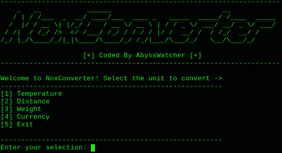

# NoxConverter

NoxConverter is a terminal based unit and currency converter developed in C. This program can make conversions between the most used units and currency. In the case of the currency the values where inserted in the 15th of April of 2024, so in the future those values can change.

These are the units and currency that NoxConverter can convert:
- Celsius, Fahrenheit and Kelvin
- Kilometers, Miles, Meters, Yards, Centimeters and Inches (converting the unit with his equivalent)
- Kilograms, Pounds, Grams and Ounces
- Euros, Dollars, GBP and Yuans

## Installation

To install NoxConverter you need to get the source code or clone the repository -> git clone https://github.com/Julen-H/NoxConverter

Then you can execute the bash script or you can compile the code by your own (bash script mode recommended). Take note that you will need a c/c++ compiler and figlet to run it on his whole.

<b>Compilation -><b> 
gcc -c unit_conversors.c 
gcc -o NoxConverter main.c unit_conversors.o 
./NoxConverter 

<b>Bash Script -><b> 
chmod +x install.sh 
./install.sh

<b>Run it -><b> 
./NoxConverter 

